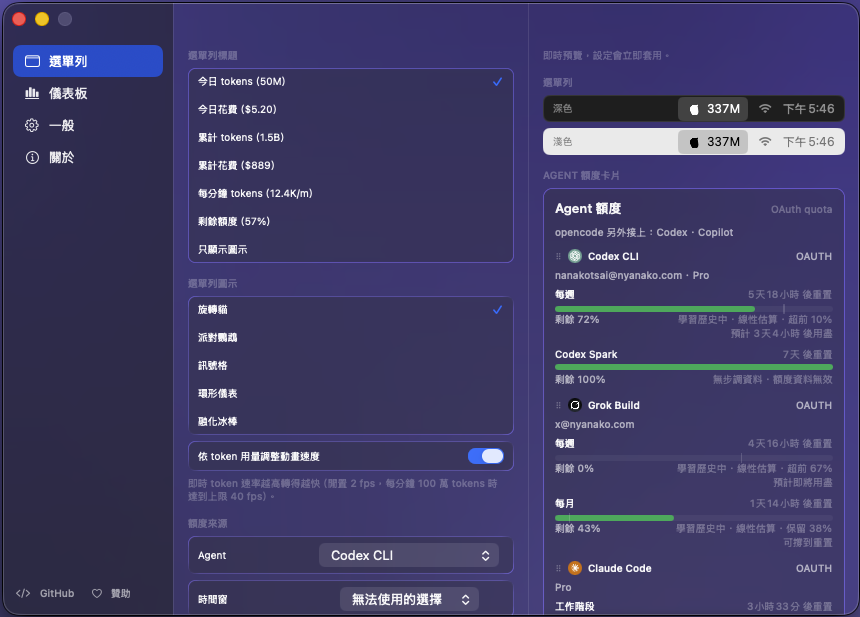

# 設定視窗側邊欄改造

## 文件目的

這份文件記錄 Windows 版設定視窗改採側邊欄分頁版面的目標形狀、與 macOS 參考實作的逐項對照，以及切成可獨立審核的執行片段。改造的起因是目前 Windows 把全部設定平鋪在單一捲動面板裡，隨著功能增加已經不可讀；macOS 版早已是側邊欄三欄版面，且兩邊的設定分節本來就是一對一可映射的，所以這不是重新設計，是把既有結構補上。

> **邊界：** 這份文件只涵蓋**版面重組**與**分節歸位**。四個尚未移植的功能（Discord、用量歸因、多語言、隱藏 lens）在這裡只登記它們在新版面中的位置，各自的移植計畫另開；第五個未移植分節 `Individual items` 是本 program 的明列非目標，見[非目標](#非目標)。

## 目錄

- [現況量測](#現況量測)
- [參考實作](#參考實作)
- [目標版面](#目標版面)
- [分頁與分節映射](#分頁與分節映射)
- [非目標](#非目標)
- [預覽欄](#預覽欄)
- [執行切片](#執行切片)
- [前置條件](#前置條件)
- [既有缺陷](#既有缺陷非本-program-引入實測時發現)
- [未決事項](#未決事項)

---

## 現況量測

兩邊的設定視窗都已經是「左邊設定、右邊即時預覽」，差別只在左半部有沒有再切出側邊欄。

| 項目 | macOS | Windows |
|---|---|---|
| 視窗尺寸 | 856 × 580 pt | 732 × 640 DIP |
| 可調整大小 | 否 | 否（`presenter.IsResizable = false`） |
| 背景 | `PopoverBackdrop`（vibrancy） | `MicaBackdrop` |
| 左半部結構 | 側邊欄 170pt + 分隔線 + 內容捲動區 | 單一 `ScrollViewer`，內容 `MaxWidth = 380` |
| 右半部結構 | 預覽欄 | 預覽 `StackPanel`，`Width = 280` |
| 分頁 | 5 個 | 無 |
| 分節 | 依分頁分散 | 10 個，全部平鋪 |
| 實作檔 | `SettingsWindowView.swift`(451) + `SettingsPanel.swift`(1186) | `SettingsWindow.cs`(769) |

Windows 目前十個分節在 `Rebuild()` 裡的實際排列順序是：

```text
Tray shows → Startup → Tray icon → Client tabs → Quota source
→ Agent limits → Live trace → Flyout size → Data refresh → About
```

> **注意：** `Startup` 夾在 `Tray shows` 與 `Tray icon` 之間，兩個托盤設定被開機自啟拆開。這不是排版偏好問題——平鋪版面沒有任何結構去阻止這件事發生，而且每加一個分節就更難察覺。側邊欄要解的是這個。

## 參考實作

macOS 版設定視窗的實際畫面是三欄：



側邊欄選中項是圓角膠囊配圖示，底部有 GitHub 與贊助連結；中欄的每個分節是「小字大寫灰色標題 + 圓角卡片」，單選清單的選中項在右側打勾；右欄頂部一行說明「即時預覽．設定會立即套用」，下面是選單列 mock 與額度卡。

> **提示：** 這份截圖是繁體中文介面，因為 macOS 有語言切換。Windows 目前全硬編英文，所以第一刀做出來的畫面會是英文的，這是預期結果，不是回歸。

## 目標版面

```text
┌────────────┬──────────────────────────┬─────────────────────┐
│ Menu bar   │  MENUBAR TITLE           │  Live preview —     │
│ Dashboard  │  ┌────────────────────┐  │  applies instantly  │
│ General    │  │ ( ) Today tokens   │  │                     │
│ About      │  │ (o) Today cost     │  │  MENU BAR           │
│            │  └────────────────────┘  │  ┌───────────────┐  │
│            │                          │  │ dark  337M    │  │
│            │  MENUBAR ICON            │  ├───────────────┤  │
│            │  ┌────────────────────┐  │  │ light 337M    │  │
│            │  │ ...                │  │  └───────────────┘  │
│            │  └────────────────────┘  │                     │
│            │                          │  AGENT LIMITS       │
│ ---------- │                          │  ┌───────────────┐  │
│ GitHub  ♡  │                          │  │ ...           │  │
└────────────┴──────────────────────────┴─────────────────────┘
   ~180 DIP            flexible                280 DIP
```

WinUI 3 的 `NavigationView` 就是這個控制項，`PaneDisplayMode="Left"` 配 `NavigationViewItem` 即可，`PaneFooter` 放 GitHub 與贊助連結。

> **不要自幹側邊欄。** `NavigationView` 已經處理選中態、鍵盤導覽、窄視窗自動收合與高對比佈景，自繪一組 `ToggleButton` 會把這些全部弄丟。

視窗需要加寬以容納側邊欄。現行 732 DIP 扣掉預覽 280 剩 452 給設定內容；加上 180 的側邊欄後建議放寬到 **900 × 640**，讓內容欄維持在 380 上下（與現行 `MaxWidth` 一致，避免所有分節的內部佈局被連帶改動）。

## 分頁與分節映射

四個分頁沿用 macOS 的命名與順序。`Usage attribution` 在 macOS 是獨立第三頁，Windows 因為功能尚未移植，暫不建立該分頁。

| 新分頁 | 分節 | Windows 現況 | macOS 對應 |
|---|---|---|---|
| **Menu bar** | Menubar title | `Tray shows` | ✅ 一致 |
| | Menubar icon | `Tray icon` | ✅ 一致 |
| | Quota source | `Quota source` | ✅ 一致 |
| | Individual items | **非目標** | `ClientTray.settingsRows` |
| **Dashboard** | Agent limits | `Agent limits` | ✅ 一致 |
| | View tabs | **缺** | `tokenbar.views.hidden` |
| | Client tabs (top bar) | `Client tabs` | ✅ 一致 |
| | Live trace | `Live trace` | ✅ 一致 |
| | Popover size | `Flyout size` | ✅ 一致（名稱依平台） |
| **General** | Startup | `Startup` | ✅ 一致 |
| | Data refresh | `Data refresh` | ✅ 一致 |
| | Discord | **缺** | `tokenbar.discord.*` |
| | Language | **缺** | `tokenbar.language` |
| **About** | About | `About` | ✅ 一致 |
| **(未建立)** | Usage attribution | **缺** | `tokenbar.usage.attribution.*` |

Windows 現有十個分節全部有歸屬，沒有孤兒，也沒有需要拆分或合併的分節。這是這一刀能純粹是版面重組的原因。

映射表的 macOS 側對照的是 `SettingsPanel.swift` 五個 page 函式的實際 `section(...)` 呼叫，每個標記為「缺」或「非目標」的分節都在下一節或執行切片表裡有歸屬。

## 非目標

| 項目 | 為什麼不做 |
|---|---|
| `Individual items`（每個 client 一個獨立托盤圖示，macOS `ClientTray`，鍵 `tokenbar.tray.clients.enabled` 與 `tokenbar.tray.clients.quotaSelections`） | Windows 要同時管理多個 `TaskbarIcon` 實例，會踩到既有的托盤建立競態——`TrayForceCreatePolicy.cs` 的存在本身就是那個問題的產物。這個 program 不處理它 |

> **注意：** 非目標不等於永久不做。想做的時候另開 program，不要當成這裡的隱藏續攤範圍。

## 預覽欄

macOS 的預覽欄**不隨分頁變化**，永遠顯示同樣三塊。Windows 目前有前兩塊。

| 預覽區塊 | macOS | Windows | 顯示條件 |
|---|---|---|---|
| Menu bar mock | 深色 + 淺色兩條 | 單條 | 無條件 |
| Agent limits card | ✅ | ✅ | `limitsEnabled` 為真 |
| Live session card | ✅ | **缺** | 無條件 |

> **注意：** 預覽欄不隨分頁變化這件事必須在實作前確認清楚。它讓側邊欄改造只需要動左半部，`_preview` 的建構邏輯完全不必碰——這是切片 S1 能維持小 diff 的前提。

## 執行切片

每個切片獨立可審核、可回滾。S1 是唯一的純版面刀；S2 之後每一刀都同時是功能移植，實際內容以各自的計畫為準，這裡只登記它們在版面中的落點。

| 切片 | 範圍 | 相依 | 驗收 |
|---|---|---|---|
| **S1** | `NavigationView` 骨架、四個分頁、十個現有分節歸位、視窗放寬至 900×640、重建保留選中分頁、`PaneFooter` 兩個連結 | — | 見 [S1 驗收](#s1-驗收) |
| **S2** | 預覽欄補 Live session card 與淺色 menu bar mock | S1 | 預覽欄三塊齊備，與 macOS 截圖同構 |
| **S3** | Dashboard / View tabs 分節（`tokenbar.views.hidden`） | S1 | 隱藏的 lens 不出現在 flyout 分頁列 |
| **S4** | General / Language 分節 + i18n 基礎建設 | S1 | 全 UI 字串可切換語言 |
| **S5** | General / Discord 分節 + Rich Presence | S1 | Discord 狀態列顯示用量 |
| **S6** | Usage attribution 分頁 + 歸因邏輯 | S1 | 側邊欄出現第五頁 |

S4 排在 S5 之前，因為 i18n 會碰到每一個字串；先做 Discord 等於保證之後要再改一次 Discord 的所有文案。

### S1 範圍細節

`PaneFooter` 的兩個連結（macOS 的 footer 是 `SettingsWindowView.swift:214-245` 的兩個 `FooterLink`）：

| 連結 | URL |
|---|---|
| GitHub | `https://github.com/Nanako0129/TokenBar-Windows` |
| 贊助 | `https://www.patreon.com/cw/Nanako0129/membership` |

> **注意：** GitHub 指向 Windows repo（macOS 版指向的是 `Nanako0129/TokenBar`，兩邊各自指自己）。贊助連結兩平台共用同一個，因為那是作者個人的贊助頁，不分平台。

重建保留分頁。`SettingsWindow.cs` 有**兩條**會整個重跑 `Rebuild()` 的路徑，兩條都必須保留當前選中分頁：

| 路徑 | 位置 | 觸發 |
|---|---|---|
| 顯示 | `Present()` → `Rebuild()` | 每次開啟設定視窗 |
| 設定寫入 | `Changed` 的 `rebuildAll` 分支 | `tokenbar.tray.animationStyle`、`tokenbar.limits.layout`、`ClientRegistry.TabHiddenKey`、`ClientRegistry.TabOrderKey` |

> ⚠️ 那四把觸發鍵橫跨 Menu bar 與 Dashboard 兩頁。**在 Menu bar 頁換個動畫樣式就會把使用者彈回第一頁**——這是 S1 引入的回歸，不是既有行為。現行程式碼的註解已經記下 full rebuild 會丟掉鍵盤焦點與捲動位置；加上分頁後它會多丟一樣東西。macOS 用 `@State selectedPage` 保留，所以關掉再開也會回到上次那頁。

### S1 驗收

`SettingsStoreTests` **不能**用來證明鍵讀寫不變——那份測試自建暫存 JSON 檔，完全不引用 `SettingsWindow`、`AppSettings` 或任何本次搬動的鍵，把 `SettingsWindow.cs` 整個刪掉它照樣全綠。而重打十個 `Section(...)` 呼叫正是最可能靜默弄壞鍵綁定的動作。

| # | 驗收項 | 觀察方式 |
|---|---|---|
| 1 | 四頁可切換，十個分節各出現在且僅出現在一頁 | 實機操作 + 每頁一張截圖 |
| 2 | 鍵字面與 setter 引數一字未改 | `git diff` 逐處確認：只有父容器改變，沒有任何鍵字串或 `Set*` 引數出現在 diff 的變更側 |
| 3 | 九個分節各自寫入後，`settings.json` 落的鍵與值正確 | 實機逐節操作一次，讀回 `settings.json` 比對 |
| 3b | Startup 開關切換後，登錄檔 `HKCU\Software\Microsoft\Windows\CurrentVersion\Run` 的值正確，且關閉再開啟設定視窗後開關狀態仍如實反映 | 實機切換前後各讀一次登錄檔 |
| 4 | 在 Menu bar 頁換動畫樣式後仍停在 Menu bar 頁 | 實機操作 |
| 5 | 在 Dashboard 頁切 client tab 顯示開關 / 用上下按鈕改排序後仍停在 Dashboard 頁 | 實機操作 |
| 6 | 關閉再開啟設定視窗回到上次那頁 | 實機操作 |
| 7 | `PaneFooter` 兩個連結各自開到上表 URL | 實機點擊 |
| 8 | 900×640 在不同 DPI 縮放下都不裁切 | 兩種縮放各一張截圖。2026-08-17 實測 150% 與 200%（200% 時 DevLog 記 `size=1800x1280`），皆不裁切 |
| 9 | 內容欄實際寬度接近 380，而非被側邊欄壓縮 | 讀 `Present()` 既有 DevLog 印出的 `scroll=WxH`；`_scroll.ActualWidth` 明顯低於 380 即為 `OpenPaneLength` 未生效 |
| 10 | `NavigationView` 內容區沒有蓋掉 Mica，與右側 `_preview` 欄不分裂 | 截圖目視；若分裂，設 `_nav.Resources["NavigationViewContentBackground"]` 為透明 |

> **注意：** 第 9 項是 `OpenPaneLength` 的回歸哨兵。`NavigationView` 的預設 pane 寬是 320，若哪天這行被拿掉，視窗放寬的效果會反轉成內容變窄，而第 1、8 項都不會失敗——只有第 9 項會。

> ⚠️ **第 1、3–8 項沒有辦法用單元測試證明。S1 完成的定義是那些截圖與 `settings.json` 讀回結果存在**，不是編譯通過或測試全綠。

驗證機器是 `Nanako@192.168.123.188`（x64 實體機，金鑰 `~/.ssh/coralline_winvm`）。該機**沒有 Rust 工具鏈也沒有 MSVC linker**，`tb_core_ffi.dll` 要從 CI 的 `smoke-win-x64` artifact 取，放進 `<repo>\target\release\` 後由 `Directory.Build.targets` 自動複製；App 用系統 dotnet 直接建。截圖腳本必須 `SetProcessDPIAware`，否則 4K 螢幕只會抓到左上角的虛擬化區域。

## 前置條件

S1 動工前必須先更新 checkout：本地 `main` 落後 `origin/main` 一週（`958617c` → `172b961`），直接在上面開分支會讓 PR 帶進大量無關回退。

工作目錄裡有東西，而且**不能用 `git reset --hard` + `git clean -fd` 一次清掉**——那會刪掉這份文件本身。逐項處置：

| 項目 | 狀態 | 處置 |
|---|---|---|
| `crates/tb_core_ffi/src/{model_report,usage_graph}.rs` | modified | 捨棄。對 `origin/main` 是淨刪除（`-16` / `-79`），確認是 stale 前身 |
| `src/TokenBar.Interop/Graph.cs` | modified | 捨棄（`-28`） |
| `src/TokenBar.Core.Tests/DtoDecodeTests.cs` | modified | 捨棄（`-81`） |
| `vendor/ENGINE.md` | modified | 捨棄（`-11`） |
| `vendor/tokscale-core` | submodule 指標被改到 `5b5f500` | 捨棄，留在 `origin/main` 的 `6a9de8c` |
| `docs/postmortem-engine-pin-stall.md` | untracked，且 `origin/main` 已有同名檔 | 先改名備份，讓 `origin/main` 的版本進來，再比對後刪除備份 |
| `docs/proposals/taskbar-widget.md` | untracked，且 `origin/main` 已有同名 tracked 檔，**兩份內容不同** | 同上：先改名備份，讓 `origin/main` 版本進來，比對後刪除備份 |
| `docs/proposals/settings-sidebar.md` 與 `docs/proposals/images/` | untracked，**本文件與其參考截圖** | 完整保留 |

> ⚠️ **`docs/proposals/` 是這份計畫自己的唯一副本**，`images/macos-settings-reference.png` 也只存在於這裡。任何形式的 `git clean` 都會連同 S1 的規格與參考畫面一起銷毀。

處置完成的判準：`docs/proposals/settings-sidebar.md` 與其 `images/` 資產仍在，且 `git status` 沒有任何可歸因於 S1 的 `vendor/tokscale-core` 或 `vendor/ENGINE.md` 變更。引擎 pin 不屬於 S1 的 diff。

## 既有缺陷（非本 program 引入，實測時發現）

| 缺陷 | 證據 | 為何不在 S1 修 |
|---|---|---|
| 系統縮放切換後（實測 150% ↔ 200%），未重啟 app 的情況下，**設定視窗與 popover 第一次開啟都卡在舊尺寸**，關掉再開才正確 | 2026-08-17 於 `192.168.123.188` 實測。`SettingsWindow.ApplySize()` 與 `FlyoutWindow` 用同一個模式：`GetDpiForWindow` → `× scale` → `AppWindow.Resize`。兩個視窗都是單例、隱藏而非銷毀，縮放改變時收不到 DPI 變更通知，第一次 `Show` 仍用舊 DPI 計算。`SettingsWindow` 另有 `if (AppWindow.Size == size) return;`，會讓它靜默跳過 resize | popover 同樣症狀，而 S1 的 diff 只含 `SettingsWindow.cs`——修一半沒有意義。正確修法是監聽 DPI 變更事件並在兩處共用，屬獨立 scope |

> **注意：** `SettingsWindow.ApplySize()` 上方那段既有註解（「Something in the show path renormalizes the size on a non-96-DPI monitor」）記的是同一族問題的另一個面向。`Activated += ApplySize` 是當時的補救，它處理得了首次顯示，處理不了「app 執行期間系統縮放改變」。

## 未決事項

| 項目 | 問題 | 需要誰決定 |
|---|---|---|
| Windows 現況畫面 | 本文的 Windows 現況全部讀自程式碼，沒有實際截圖對照。不阻擋動工，但 S1 驗收要有 before 才能對照 | 使用者（需在 Windows 機器操作） |
| 側邊欄圖示 | macOS 用 SF Symbols；Windows 對應的 Segoe Fluent Icons 字符需逐一挑選 | 實作時決定，非阻塞 |
| 視窗尺寸 900×640 | 依側邊欄 180 + 內容 380 + 預覽 280 + 間距推算，未在實機驗證過是否過寬 | S1 第一輪視覺回饋 |

---

## 相關文件

| 文件 | 內容 |
|---|---|
| [`taskbar-widget.md`](taskbar-widget.md) | 工作列小工具提案 |
| [`../../vendor/ENGINE.md`](../../vendor/ENGINE.md) | 共用引擎 pin 與所有權邊界 |
