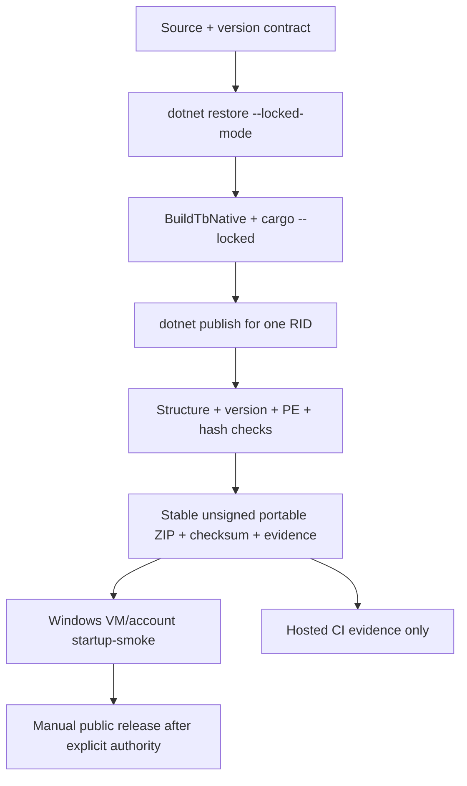

# TokenBar Windows Release Contract

## 目錄

- [文件目的](#文件目的)
- [Published stable outcome](#published-stable-outcome)
- [Release boundary](#release-boundary)
- [Version and toolchain locks](#version-and-toolchain-locks)
- [Build command and outputs](#build-command-and-outputs)
- [Verification evidence](#verification-evidence)
- [Startup gate](#startup-gate)
- [CI and authority gates](#ci-and-authority-gates)
- [Phase 11/12 non-goals](#phase-1112-non-goals)

## 文件目的

這份文件定義 Windows App `v0.1.0` stable、未簽署、portable release
transaction 契約與已完成的 Phase 10 outcome。它描述版本來源、鎖定的
dependency/toolchain、產物、evidence，以及哪些檢查必須在 Windows 主機
完成。這次發布不包含簽署、installer、updater 或 Velopack。

> **這份文件是已封存的紀錄，不是當前的 build 說明。** 文件內所有
> `TokenBar` 產品名、`TokenBar-App-0.1.0-win-<rid>.zip` 產物名與
> `TokenBar.App.exe` 命令，都是 `v0.1.0`（tag 指向 `aa671e0`，當時
> `TbProductName=TokenBar`）實際發佈的歷史事實，稽核與重現該次發布時應以
> 這些名稱為準。產品名之後改為 `Syrtis`，`build-app-artifact.ps1` 一律從
> `TbProductName` 推導名稱，所以**今天**執行同一條命令會得到
> `Syrtis-App-<version>-win-<rid>.zip` 與 `Syrtis.App.exe`。下一次發布屬於
> Phase 11（Velopack installer/updater），會有自己的 release contract 文件；
> 本文件不再更新為當前命名。

Preview history: [`v0.1.0-preview.1` published prerelease](https://github.com/Nanako0129/TokenBar-Windows/releases/tag/v0.1.0-preview.1).

> **核心原則：** Hosted CI 可以證明結構、版本、PE architecture 與 hash，
> 但不能把 x64 runner 上的 cross-build 說成 ARM64 runtime 或互動式 WinUI
> startup gate。

## Published stable outcome

[`v0.1.0`](https://github.com/Nanako0129/TokenBar-Windows/releases/tag/v0.1.0)
was published on 2026-07-29 as the public, non-prerelease Latest release. Its
lightweight tag points directly to
`aa671e0730ecb2581415e6571842ad086ab06e47`. The release has eight assets: one
ZIP, checksum, sanitized build-evidence JSON, and startup-smoke sentinel for
each of `win-x64` and `win-arm64`.

| RID | Published ZIP SHA-256 | Native startup result |
|---|---|---|
| `win-x64` | `ce04b5c1ce0797d5d3fc6ad3a19f8cba227600632b1f509eb6131180703a3fab` | `X64`, `tray-ready`, task result `0` |
| `win-arm64` | `4c46b1e6b1a3e206363343d2023dd48ac8623baeca6bca5ea3414f6fa4f3333d` | `Arm64`, `tray-ready`, task result `0` |

Both startup runs used the separately authorized active `Nanako` profile with
an executable-specific outbound block. This was a labelled non-disposable
exception, not an isolated-host claim. The eight public asset names, byte
lengths, and GitHub SHA-256 digests matched the locally verified release set,
and each unauthenticated download returned HTTP 200 after publication.

## Release boundary

Phase 10 的 stable 產物是 repo-owned PowerShell command 產生的 version/RID-labelled
App ZIP、SHA-256 checksum 與 sanitized JSON evidence。ZIP 保留在 private
runner/host output root；hosted CI 只上傳 evidence 與 checksum，絕不把
App ZIP、EXE 或 DLL 當成 CI artifact，也不負責建立 tag 或 GitHub Release。
`v0.1.0` 的 public tag/assets 是在 separate explicit authority gate 後手動
發布；future publication remains a separate authority gate.



`--startup-smoke` is opt-in. Launches without that flag follow the existing
tray-resident behavior exactly.

## Version and toolchain locks

`Directory.Build.props` is the authoritative version source. `app.manifest` keeps
a checked numeric literal, and the artifact command rejects drift between that
literal and the props file.

| Contract item | Locked value | Authority or behavior |
|---|---|---|
| Product name | `TokenBar` | `TbProductName`; App assembly/executable and artifact basename derive from this property |
| Package SemVer | `0.1.0` | `TbSemanticVersion`, `Version`, `PackageVersion` |
| InformationalVersion | `0.1.0` | Exact About/sentinel value; source-revision suffix disabled |
| AssemblyVersion | `0.1.0.0` | `v0.1.0-preview.1` and stable `v0.1.0` use the same numeric identity |
| FileVersion | `0.1.0.0` | PE/file metadata |
| Win32 manifest version | `0.1.0.0` | `src/TokenBar.App/app.manifest`; verifier rejects drift |
| .NET SDK | `10.0.301` | [`global.json`](../global.json), roll-forward disabled |
| Rust toolchain | `1.96.1`, minimal profile | [`rust-toolchain.toml`](../rust-toolchain.toml) |
| NuGet graph | Lock files required | `RestorePackagesWithLockFile=true`; release restore uses `--locked-mode` |
| Cargo graph | `Cargo.lock` required | Native build uses `cargo ... --locked` |

The published `v0.1.0-preview.1` remains the recorded unsigned prerelease
history; stable is the separate published `v0.1.0` tag at the exact source SHA
recorded above.

The App direct package versions are intentionally exact: Windows App SDK
`1.8.260710003`, Windows SDK BuildTools `10.0.28000.2526`, H.NotifyIcon.WinUI
`2.4.1`, and Vortice Direct3D11/D3DCompiler/DXGI `3.8.3`.

## Build command and outputs

Run from a clean Git checkout on Windows with a new, empty output root. The
command accepts exactly one RID and does not delete an existing directory. It
requires PowerShell `7.0+` in addition to the locked .NET and Rust toolchains;
dirty tracked or untracked files are rejected so `gitSha` identifies the exact
source. Initialize the pinned shared engine before running the artifact build.

```powershell
git submodule update --init --recursive

.\scripts\build-app-artifact.ps1 `
  -Rid win-x64 `
  -OutputRoot "$env:RUNNER_TEMP\tokenbar-phase10-x64"

.\scripts\build-app-artifact.ps1 `
  -Rid win-arm64 `
  -OutputRoot "$env:RUNNER_TEMP\tokenbar-phase10-arm64"
```

The command validates `Directory.Build.props` and `app.manifest`, checks exact
SDK/toolchain versions, restores the App and Smoke project graphs for the
selected RID in locked mode, runs Cargo with `--locked`, invokes the existing
`BuildTbNative` mapping/verifier with its own locked-Cargo switch, and publishes
the selected RID. The App project and packaging command both derive the current
assembly/executable and artifact basename from `TbProductName=TokenBar`; this is
a bounded future rename seam, not a Phase 10 product rename. The command then
checks the main EXE, `tb_core_ffi.dll`, PRI, XBF, all four animation asset
directories and their expected frames, PE machine values, version metadata, and
native source/publish byte equality.

| Output | Purpose | Upload policy |
|---|---|---|
| `TokenBar-App-0.1.0-win-<rid>.zip` | Stable unsigned portable App package | Never uploaded by hosted CI |
| `TokenBar-App-0.1.0-win-<rid>.zip.sha256` | ZIP SHA-256 and filename | Uploaded as sanitized CI evidence |
| `evidence.json` | Version, RID, toolchain, git SHA, inventory, hashes, gate boundary | Uploaded as sanitized CI evidence |
| `publish/` | Staging files used for checks and ZIP creation | Private command output only |

ZIP byte-for-byte reproducibility is not claimed; every produced ZIP is
identified by its SHA-256 evidence.

## Verification evidence

`evidence.json` contains no absolute paths, user profile names, credentials or
secrets. Its inventory paths are relative to the publish root and each file has
its byte length and SHA-256. The record also includes the exact sanitized values
below.

| Evidence field | Required value or shape |
|---|---|
| `gitSha` | 40-character checkout SHA |
| `dotnetVersion` | `10.0.301` |
| `rustc.release` | `1.96.1` |
| `rustc.commitHash` | Concrete rustc commit hash, not `unknown` |
| `rid` | `win-x64` or `win-arm64` |
| `semanticVersion` / `informationalVersion` | `0.1.0` |
| `assemblyVersion` / `manifestVersion` | `0.1.0.0` |
| `artifact.sha256` | SHA-256 of the labelled ZIP |
| `inventory[].path` | Relative path with no drive or profile prefix |

Missing lock files, unsupported RID, toolchain/version drift, wrong PE machine,
stale native bytes, missing WinUI assets, and evidence path leakage are hard
failures. The command does not fabricate a lock graph when restore inputs are
unavailable; the generated `packages.lock.json` files must be produced by an
authorized Windows restore and committed before release CI can pass.

## Startup gate

The bounded probe is a separate host action after the package has passed
structure checks:

```powershell
TokenBar.App.exe --startup-smoke C:\phase10\sentinel.json
```

After `FlyoutWindow` and `TrayService` construction and one
`DispatcherQueue` turn, the App atomically creates the new sentinel with its
PID, exact informational version, process architecture and `tray-ready` stage.
Missing, invalid or already-existing paths are hard failures. The process sets
`ExitCode` and routes shutdown through `TrayService.QuitApp` so feed/timer/tray
and GDI cleanup runs before `Application.Exit`.

The published `v0.1.0-preview.1` x64 and ARM64 startup-smoke runs used the active
`Nanako` profile with outbound network blocked under explicit approval. This was
a non-disposable exception for the prerelease, not disposable isolation, and it
must never be described as isolated. Both runs reached `tray-ready` and exited
with task result `0`.

For stable, the default gate is a separately provided disposable Windows
VM/account snapshot with production credentials absent and outbound network
blocked. An environment-variable reassignment or a different working directory
alone is not isolation. A non-disposable exception requires separate explicit
authorization, must be labelled as a non-disposable exception, and must never
be called isolated. The published `v0.1.0` stable x64 and ARM64 runs used that
separately authorized active `Nanako` exception with executable-specific
outbound blocking. Both reached `tray-ready`, exited with task result `0`, and
produced the attached startup-smoke sentinels. Hosted CI does not execute this
probe and must not describe its evidence as an interactive startup pass.

The M19-B1 historical real-ARM64 result (2026-07-27: 351 Rust tests, 12
provider-v3 CrossCheck cases, PE checks and synthetic WinUI startup) is recorded
in [the public issue comment](https://github.com/Nanako0129/TokenBar/issues/45#issuecomment-5091092629).
It is historical evidence only and does not satisfy or replace the Phase 10
published-artifact x64/ARM64 gates.

## CI and authority gates

| Gate | Hosted CI responsibility | Required authority or host follow-up |
|---|---|---|
| Dependency restore | Restore every required project with `--locked-mode` | Commit generated lock files; do not hand-edit graph contents |
| Native/App build | Run exact SDK/Rust, `cargo --locked`, `BuildTbNative`, and both RIDs | Preserve `src/Directory.Build.targets` mapping and native verifier |
| Artifact command | Exercise the repo-owned command in runner temp for x64 and ARM64 | Keep ZIP/EXE/DLL out of CI artifacts; public attachment requires separate release authority |
| PE/version/hash | Check inventory, architecture, version mapping and stale-DLL equality | Treat any mismatch as a release blocker |
| Interactive startup | No hosted claim | Run the bounded probe on the default disposable host or an explicitly authorized, labelled non-disposable exception; `v0.1.0` uses the active `Nanako` profile with outbound blocked |
| Public stable release | No CI publication, signing, tag, or asset upload | `v0.1.0` was published manually after its separate explicit authority decision; future publication still requires its own gate |

## Phase 11/12 non-goals

Phase 10 does not add Velopack packaging, signing credentials, automated
publication from hosted CI, winget/Scoop manifests, general logger or DI
rewrites, settings migrations, network-suppression seams, or a replacement for
the existing native build plumbing. Velopack/signing/installer/updater is the
next Phase 11 priority; winget/Scoop is Phase 12 and remains unopened until a
later authority gate explicitly approves it.

The release command is therefore a stable unsigned portable evidence producer.
A successful hosted job or historical ARM64 VM result alone is not permission
to publish future artifacts, attach an App binary, or claim publication.
`v0.1.0` was published only after its separate explicit authority and
published-artifact startup gates completed.
